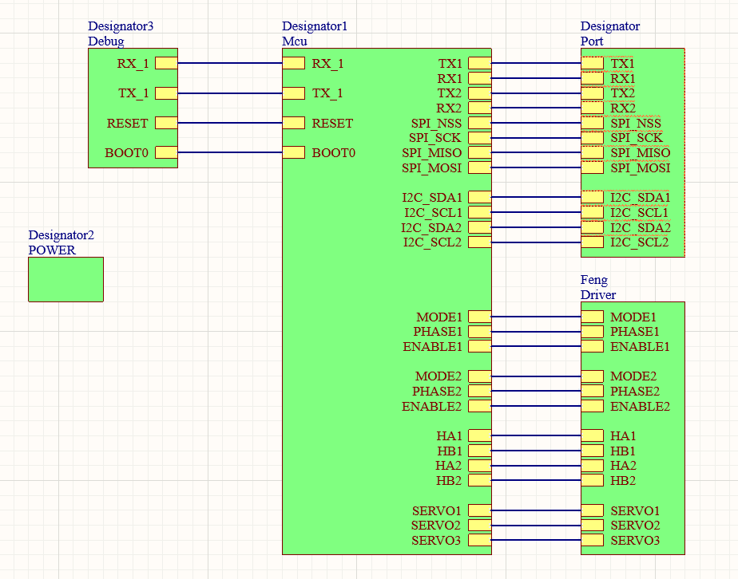
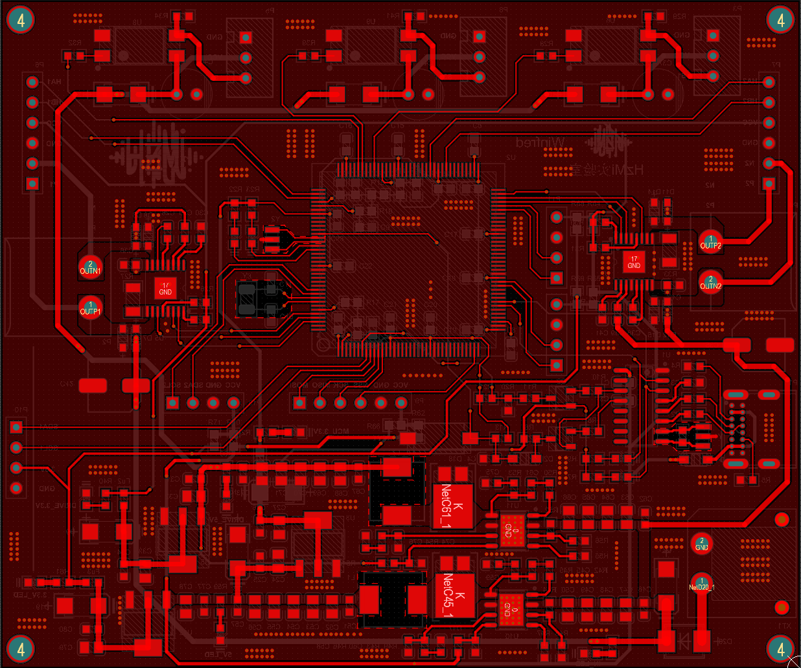
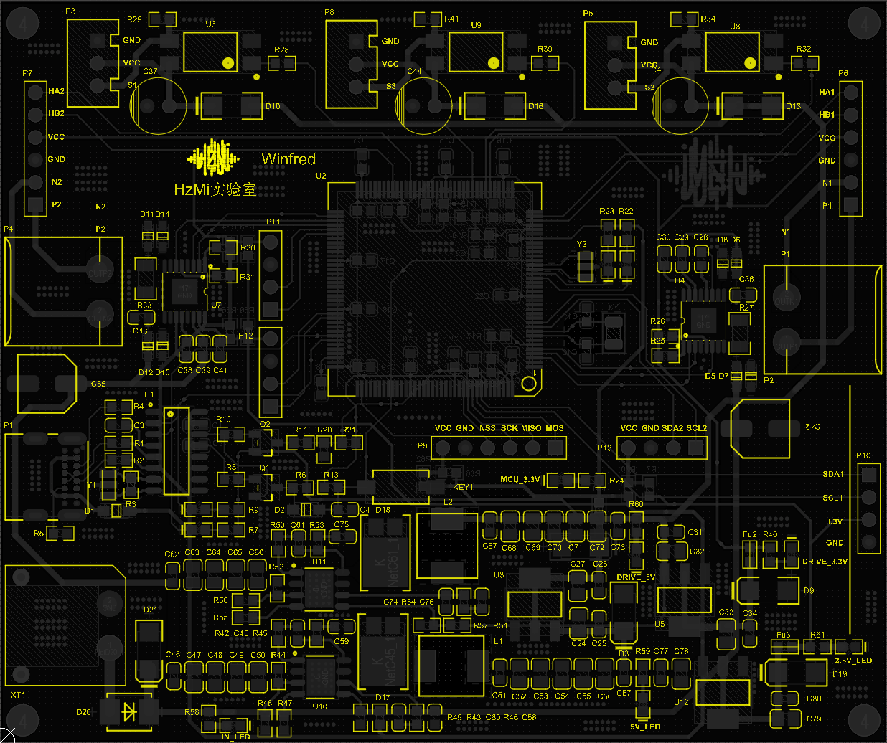
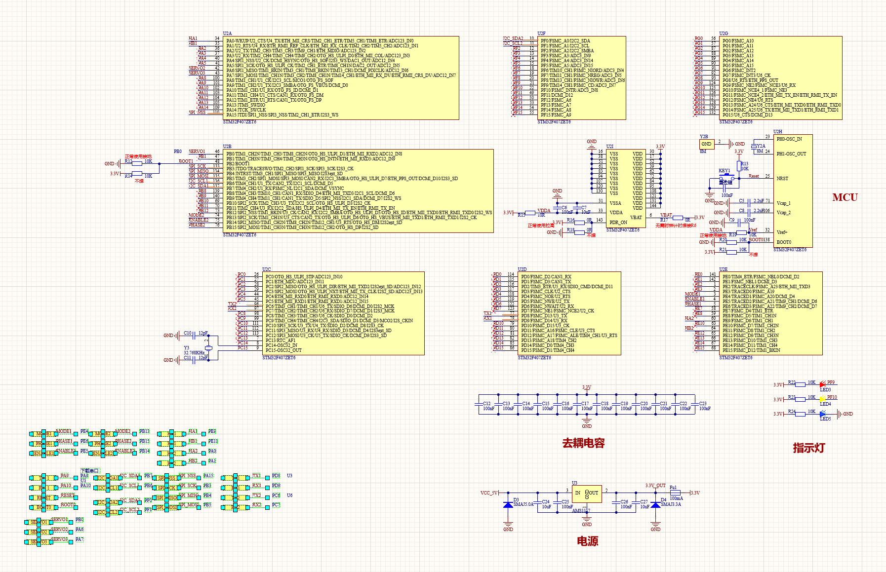
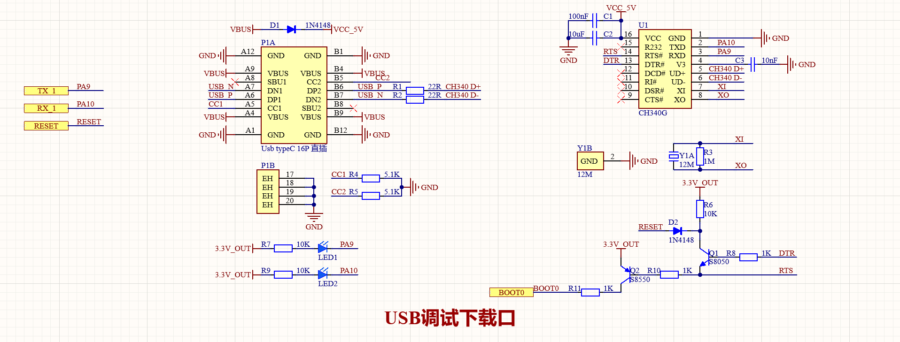
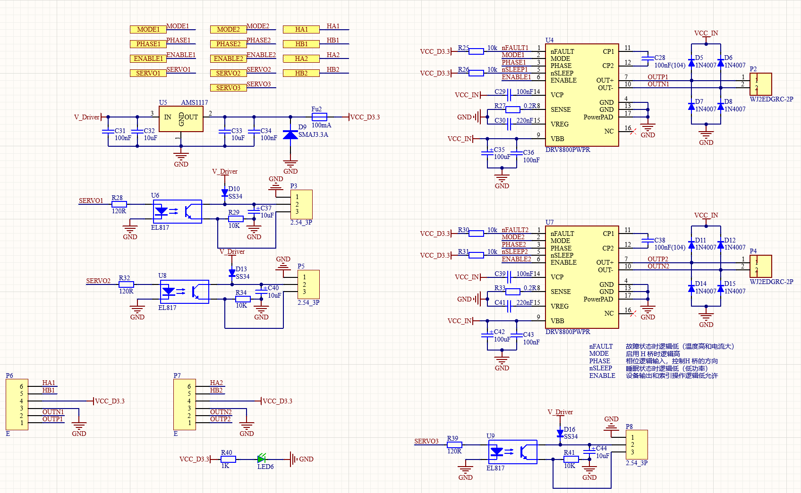
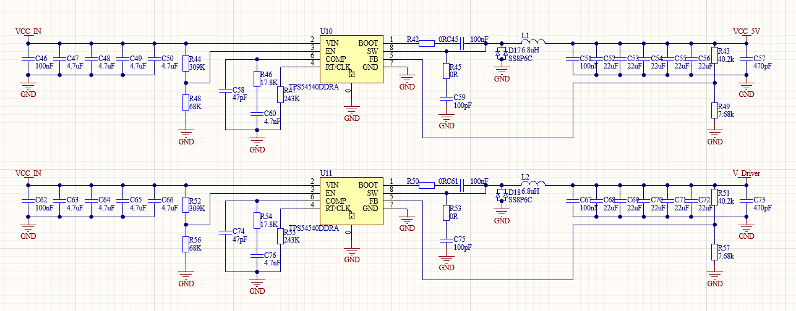
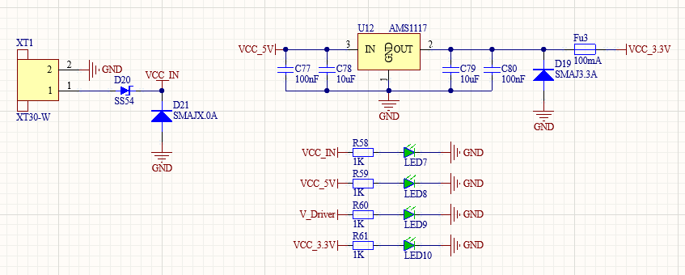

# 硬件设计部分
## 第一代硬件主要设计部分
|MCU主控芯片            |Driver驱动芯片          |Power电源芯片           |Debug调试回馈芯片       |尺寸工艺                 |
|----------------------|-----------------------|-----------------------|-----------------------|-------------------------|
|stm32f407zet6         | Servo-Part->EL817     |TPS5454DDAR            |TypeC+CH340G           |10*10cm                 |
|                      |Motor-Part->DRV8800    |                       |                       |两层板+大面积铺铜，输入电压可达30v，额度电流可达5A          |     

### 推荐使用12V DC或24V DC电池输入                                                                                              
### 刚刚好可以蹭嘉立创的免费打板！

## 功能如下所示
- 两路串口通信
- 一路SPI
- 两路IIC
- 两路直流驱动输出+编码器AB相回馈
- 三路舵机驱动

## AD设计展示图

## AD设计丝印图

## MCU设计部分原理图

## Debug(USB)调试部分原理图

## Driver驱动部分原理图

## Power电源部分原理图

